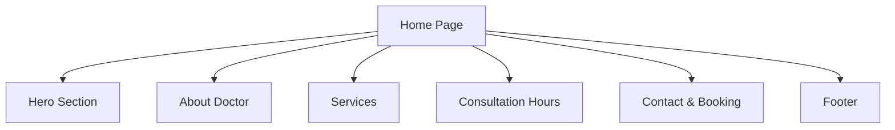

# Doctor's Website Implementation Plan

## 1. Website Structure (Single Page Application)


## 2. Core Components
### Hero Section
- Doctor's name and qualifications
- Tagline: "Expert Physician & Diabetologist"
- Call-to-action button: "Book Appointment" (triggers phone call)
- Doctor's image (`image copy 2.png`) with fade-in animation

### About Section
- Professional bio
- Qualifications (MBBS, MD)
- Specialization details

### Services Section
- Medical services list
- Animated accordion for details
- Font-based icons

### Consultation Hours
- Schedule table (4:30 PM - 7:00 PM, closed Sunday)
- Live "Open/Closed" indicator
- Current day highlighting

### Contact & Booking
- Prominent phone number: 8714 886 528
- "Call Now" button with pulse animation
- Alternative contact form

## 3. Technical Implementation
- **Framework**: HTML5/CSS3/JavaScript
- **Responsive Design**:
  - Mobile-first approach
  - Flexbox/Grid layout
  - Viewport-relative units
- **Animations**:
  - CSS transitions for interactions
  - Scroll-based reveals
  - Micro-animations for buttons
- **Performance**:
  - Image optimization
  - Lazy loading
  - Minimal JavaScript

## 4. Content Mapping
| Section        | Content from bijoy.md            |
|----------------|----------------------------------|
| About Doctor   | Name, Qualifications             |
| Services       | Specialization                   |
| Consultation   | Time, Days                       |
| Contact        | Booking Number                   |

## 5. File Structure
```
index.html
styles/
  └── main.css
scripts/
  └── app.js
assets/
  └── image copy 2.png
```

## 6. Development Timeline
1. Project Setup: 1 hour
2. Responsive Layout: 2 hours
3. Content Sections: 1 hour
4. Animations: 1 hour
5. Testing: 1 hour